# Database Entity-Relationship Diagram

Generated directly from the SQLAlchemy models under `app/models/` (the
source of truth; schema changes land there first and are expressed as
Alembic migrations under `alembic/versions/`). 21 tables, PostgreSQL.

## How to read this

- Crow's-foot notation: `||` = exactly one, `|o` = zero or one, `}o` =
  zero or many, `}|` = one or many. The symbol nearest an entity describes
  how many rows *of that entity* participate per row on the other side.
- `PK` = primary key, `FK` = foreign key, `UK` = unique constraint.
- Nullable FK columns render as `|o` (optional participation) and map to
  `ON DELETE SET NULL` in the schema; `NOT NULL` FK columns render as `||`
  (mandatory) and map to `ON DELETE CASCADE` or `RESTRICT` — see the
  [cascade table](#cascade--delete-semantics) below for the exact rule per
  relationship.
- This file renders natively on GitHub, in VS Code (with a Mermaid
  extension), and in Claude Code. If your viewer doesn't render Mermaid,
  read the fenced block below as an outline instead.

## Diagram

```mermaid
erDiagram
    categories ||--o{ influencers : "categorizes"
    creators |o--o{ influencers : "groups (optional)"
    influencers ||--o{ posts : "publishes"
    influencers ||--o{ profile_snapshots : "snapshots"
    influencers ||--o{ scrape_jobs : "is target of"
    influencers ||--o{ recommendations : "generates"
    categories ||--o{ recommendations : "benchmarked against"
    categories ||--o{ category_benchmarks : "benchmarked by"
    posts ||--o{ comments : "has"
    posts ||--o{ post_metrics_snapshots : "snapshots"
    posts ||--o| feature_store : "extracted into"
    posts ||--o| post_outlier_metrics : "scored as"
    instagram_accounts |o--o{ scrape_jobs : "services"
    youtube_api_keys |o--o{ scrape_jobs : "services"
    scrape_jobs ||--o{ scrape_runs : "attempted by"
    instagram_accounts |o--o{ credential_health_snapshots : "health history"
    youtube_api_keys |o--o{ credential_health_snapshots : "health history"

    categories {
        uuid id PK
        string name UK
        boolean is_active
        datetime created_at
        datetime updated_at
    }

    creators {
        uuid id PK
        string name UK "cross-platform grouping label"
        datetime created_at
        datetime updated_at
    }

    influencers {
        uuid id PK
        string handle UK "unique with platform"
        string platform UK "instagram or youtube, unique with handle"
        string platform_user_id "channel ID / IG pk, set on first scrape"
        string profile_pic_url "refreshed every scrape"
        uuid creator_id FK "nullable, SET NULL on creator delete"
        uuid category_id FK "NOT NULL, RESTRICT on category delete"
        string account_type "business or individual"
        boolean is_active
        boolean paused_by_category "true only if category-level pause did this"
        string deactivation_reason "nullable, e.g. handle_not_found"
        date scrape_posts_since "nullable backfill floor"
        boolean backfill_completed
        string backfill_cursor "nullable, feed next_max_id"
        datetime created_at
        datetime updated_at
    }

    posts {
        uuid id PK
        uuid influencer_id FK "CASCADE"
        string shortcode UK
        string media_pk "nullable"
        text caption "nullable"
        text title "nullable, YouTube only"
        string_array hashtags
        string_array mentions
        datetime posted_at "indexed with influencer_id"
        text permalink "nullable"
        text accessibility_caption "nullable"
        boolean is_paid_partnership
        string product_type "nullable, drives short/long-form split"
        jsonb music_metadata "nullable"
        integer original_height "nullable"
        integer original_width "nullable"
        jsonb locations "nullable"
        jsonb coauthor_producers "nullable"
        jsonb tagged_usernames "nullable"
        boolean counts_disabled
        jsonb platform_metadata "nullable, YouTube extras"
        datetime created_at
        datetime updated_at
    }

    comments {
        uuid id PK
        uuid post_id FK "CASCADE, indexed"
        string comment_id UK "up to 128 chars, YouTube reply IDs are parentId.childId"
        string parent_comment_id "nullable, indexed, set for replies"
        string username
        string full_name
        boolean is_verified
        boolean is_from_creator "indexed"
        string author_external_id "nullable, YouTube channel ID"
        text author_profile_pic_url "nullable"
        boolean author_is_private
        text text
        integer like_count
        integer child_comment_count
        boolean liked_by_creator
        boolean is_edited
        boolean reported_as_spam
        datetime commented_at
        datetime created_at
        datetime updated_at
    }

    profile_snapshots {
        uuid id PK
        uuid influencer_id FK "CASCADE"
        date scraped_at
        integer followers
        integer following
        integer posts
        text biography "nullable"
        jsonb biography_with_entities "nullable"
        jsonb bio_links "nullable"
        jsonb pronouns "nullable"
        string external_url "nullable"
        boolean is_verified
        boolean is_business_account
        boolean is_professional_account
        string category_name "nullable"
        string category_enum "nullable"
        string overall_category_name "nullable"
        string business_contact_method "nullable"
        string business_email "nullable"
        string business_phone_number "nullable"
        integer highlight_reel_count
        boolean has_clips
        boolean has_guides
        boolean has_channel
        integer mutual_followers_count
        boolean is_meta_verified
        boolean hides_like_view_counts
        boolean has_ar_effects
        string business_category_name "nullable"
        bigint total_views "nullable, YouTube lifetime channel views"
        boolean subscribers_hidden
        jsonb platform_metadata "nullable, YouTube extras"
        datetime created_at
        datetime updated_at
    }

    post_metrics_snapshots {
        uuid id PK
        uuid post_id FK "CASCADE, indexed"
        date scraped_at
        integer likes "nullable = platform hides it, never fabricated 0"
        integer comments "nullable"
        bigint views "nullable"
        bigint reposts "nullable"
        datetime created_at
        datetime updated_at
    }

    feature_store {
        uuid id PK
        uuid post_id FK,UK "CASCADE, one row per post"
        integer caption_length
        integer word_count
        integer hashtag_count
        integer mention_count
        integer emoji_count
        boolean has_cta
        boolean has_question
        jsonb keywords
        string detected_language "nullable"
        integer posting_hour "0-23"
        integer posting_weekday "0-6"
        string media_type
        float reel_duration_s "nullable"
        datetime first_comment_at "nullable"
        integer time_to_first_comment_s "nullable"
        integer creator_reply_count
        integer time_to_first_creator_reply_s "nullable"
        datetime created_at
        datetime updated_at
    }

    post_outlier_metrics {
        uuid post_id PK,FK "CASCADE, re-written on every new snapshot"
        float outlier_score "nullable, composite score"
        float baseline_multiple "nullable, N x channel median"
        float vph_current "nullable, true views/hr from last 2 snapshots"
        float vph_lifetime "nullable, views / hours since posted"
        float engagement_ratio "nullable, vs rolling median engagement"
        float baseline_median "nullable, denominator behind baseline_multiple"
        datetime computed_at
    }

    scrape_jobs {
        uuid id PK
        uuid influencer_id FK "CASCADE"
        string status "pending, running, completed, failed"
        integer retry_count
        datetime started_at "nullable"
        datetime finished_at "nullable"
        float duration_s "nullable"
        datetime last_heartbeat_at "nullable, stale-job reaper watches this"
        datetime cancel_requested_at "nullable"
        text error_message "nullable"
        integer posts_processed
        integer comments_processed
        integer quota_units_used "nullable, YouTube only"
        uuid instagram_account_id FK "nullable, SET NULL, indexed"
        uuid youtube_api_key_id FK "nullable, SET NULL, indexed"
        datetime created_at
        datetime updated_at
    }

    scrape_runs {
        uuid id PK
        string worker_id
        uuid job_id FK "CASCADE, one row per attempt of a job"
        datetime created_at
    }

    instagram_accounts {
        uuid id PK
        string username UK
        string status "indexed: active, in_use, checkpoint_required, disabled, pending_login, login_failed"
        string auth_method "cookies or login"
        text session_cookies_encrypted "Fernet-encrypted"
        datetime session_captured_at
        text password_encrypted "nullable, Fernet-encrypted"
        text proxy_encrypted "nullable, Fernet-encrypted, pinned egress IP"
        string user_agent
        string locale
        string timezone
        datetime last_used_at "nullable"
        datetime last_success_at "nullable"
        datetime last_failure_at "nullable"
        integer failure_count
        datetime cooldown_until "nullable, indexed"
        string locked_by "nullable, lease owner"
        datetime lease_expires_at "nullable"
        text error_message "nullable"
        datetime created_at
        datetime updated_at
    }

    youtube_api_keys {
        uuid id PK
        string label UK
        text api_key_encrypted "Fernet-encrypted"
        string status "indexed: active, quota_exhausted, invalid, disabled"
        integer quota_used_today
        datetime quota_reset_at "nullable, next midnight Pacific"
        datetime last_used_at "nullable"
        datetime last_success_at "nullable"
        datetime last_failure_at "nullable"
        integer failure_count
        text error_message "nullable"
        datetime created_at
        datetime updated_at
    }

    credential_health_snapshots {
        uuid id PK
        datetime snapshot_at "indexed"
        string platform "indexed"
        string label "denormalized copy, survives source row deletion"
        string status
        integer failure_count
        integer quota_used_today "nullable, YouTube only"
        uuid instagram_account_id FK "nullable, SET NULL, indexed"
        uuid youtube_api_key_id FK "nullable, SET NULL, indexed"
    }

    queue_depth_snapshots {
        uuid id PK
        datetime snapshot_at "indexed"
        string backend "redis or sqs"
        integer main_depth "nullable"
        integer dlq_depth "nullable, NULL for Redis backend (no DLQ concept)"
    }

    category_benchmarks {
        uuid id PK
        uuid category_id FK "CASCADE"
        integer avg_followers
        float avg_engagement_rate
        float median_engagement_rate
        integer avg_caption_length
        float avg_hashtag_count
        float avg_posting_freq_week
        float avg_reels_per_week
        integer best_posting_hour
        integer best_posting_weekday
        float avg_reel_duration_s
        jsonb top_hashtags
        jsonb top_keywords
        jsonb top_posting_patterns
        integer sample_size
        datetime computed_at
        datetime created_at
        datetime updated_at
    }

    recommendations {
        uuid id PK
        uuid influencer_id FK "CASCADE"
        uuid category_id FK "CASCADE"
        string priority "high, medium, low"
        string recommendation_type
        string title
        text body
        string metric_value "nullable"
        string benchmark_value "nullable"
        datetime generated_at
        datetime created_at
        datetime updated_at
    }

    analytics_cache {
        uuid id PK
        string cache_key UK
        jsonb data
        datetime expires_at "nullable"
        datetime created_at
        datetime updated_at
    }

    audit_logs {
        uuid id PK
        string action
        string entity_type "nullable"
        string entity_id "nullable"
        jsonb details "nullable"
        datetime created_at
        datetime updated_at
    }

    raw_responses {
        uuid id PK
        string endpoint
        string handle
        jsonb payload
        integer status "HTTP status code"
        datetime scraped_at
        datetime created_at
        datetime updated_at
    }

    scheduler_metadata {
        uuid id PK
        string job_name UK
        datetime last_run_at "nullable"
        datetime next_run_at "nullable"
        string status "idle, running, etc."
        datetime created_at
        datetime updated_at
    }
```

## Domain groupings

- **Core content graph** — `categories`, `creators`, `influencers`,
  `posts`, `comments`, `profile_snapshots`, `post_metrics_snapshots`. The
  scraped data itself: one `influencers` row per platform account, daily
  `profile_snapshots`/`post_metrics_snapshots` build the time series
  everything else derives from.
- **Derived analytics** — `feature_store` (extracted once per post),
  `post_outlier_metrics` (re-computed every time new metrics land),
  `category_benchmarks`, `recommendations`, `analytics_cache` (currently
  unused by any query path).
- **Credential pool** — `instagram_accounts`, `youtube_api_keys`, and
  their append-only `credential_health_snapshots` history.
- **Job orchestration** — `scrape_jobs` (one row per scrape attempt) and
  `scrape_runs` (one row per worker pickup of a job, for retry/heartbeat
  forensics).
- **Operational / observability** — `queue_depth_snapshots`,
  `scheduler_metadata`, `audit_logs`, `raw_responses` (debug payload
  capture, no FKs to the rest of the schema).

## Cascade & delete semantics

The one non-obvious part of this schema: several parent→child
relationships rely on `passive_deletes=True` at the ORM level so
SQLAlchemy trusts Postgres's `ON DELETE CASCADE` instead of trying to
null out a `NOT NULL` foreign key first (see `app/models/influencer.py`
and `app/models/post.py` for the full rationale — this was the exact bug
behind influencer deletes 500ing for any account with posts).

| Parent | Child | FK column | On delete | Effect |
|---|---|---|---|---|
| `categories` | `influencers` | `category_id` | `RESTRICT` | Can't delete a category while any influencer references it |
| `creators` | `influencers` | `creator_id` | `SET NULL` | Deleting a creator group unlinks its influencers, never deletes their data |
| `influencers` | `posts` | `influencer_id` | `CASCADE` | Deleting an influencer deletes all its posts |
| `influencers` | `profile_snapshots` | `influencer_id` | `CASCADE` | |
| `influencers` | `scrape_jobs` | `influencer_id` | `CASCADE` | |
| `influencers` | `recommendations` | `influencer_id` | `CASCADE` | |
| `categories` | `recommendations` | `category_id` | `CASCADE` | |
| `categories` | `category_benchmarks` | `category_id` | `CASCADE` | |
| `posts` | `comments` | `post_id` | `CASCADE` | |
| `posts` | `post_metrics_snapshots` | `post_id` | `CASCADE` | |
| `posts` | `feature_store` | `post_id` | `CASCADE` | |
| `posts` | `post_outlier_metrics` | `post_id` | `CASCADE` | PK and FK are the same column |
| `scrape_jobs` | `scrape_runs` | `job_id` | `CASCADE` | |
| `instagram_accounts` | `scrape_jobs` | `instagram_account_id` | `SET NULL` | Deleting the account keeps job history, just anonymizes which account ran it |
| `youtube_api_keys` | `scrape_jobs` | `youtube_api_key_id` | `SET NULL` | |
| `instagram_accounts` | `credential_health_snapshots` | `instagram_account_id` | `SET NULL` | Health history outlives the credential row |
| `youtube_api_keys` | `credential_health_snapshots` | `youtube_api_key_id` | `SET NULL` | |

## Notable design decisions baked into the schema

- **`Influencer` is per-platform, `Creator` is cross-platform.** The same
  real-world person/brand gets one `influencers` row per platform
  (different scrape mechanics, handles, and metrics entirely), optionally
  grouped under one `creators` row purely for the dashboard's combined
  view. Category and scrape settings stay on `Influencer`, not `Creator`,
  since benchmarks/recommendations are computed per platform account.
- **NULL vs. 0 is load-bearing** throughout `post_metrics_snapshots`,
  `posts`, and `post_outlier_metrics` — NULL means "platform doesn't
  expose this metric for this item" (e.g. YouTube hidden likes, Instagram
  photo posts with no view count), while 0 means a real, confirmed zero.
  Several analytics functions (outlier scoring, format breakdowns) treat
  the two very differently.
- **`ScrapeJob` credential attribution is exactly one of two FKs.**
  `instagram_account_id` and `youtube_api_key_id` are both nullable and
  mutually exclusive in practice — whichever matches the job's
  influencer's platform is set, the other stays NULL.
- **`AnalyticsCache` exists but is currently unused** — no query path
  reads or writes it as of this writing; it was modeled ahead of an
  eventual caching layer that hasn't been built yet.
